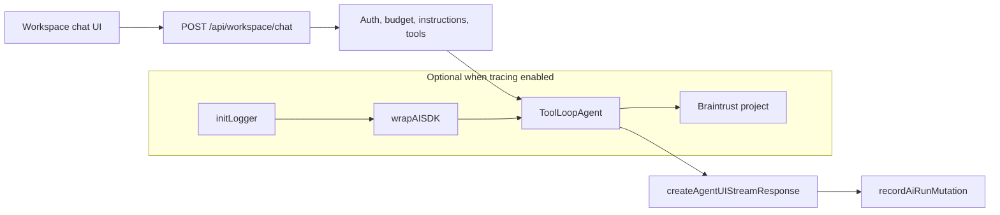

# Implementation brief: Braintrust for workspace chat

**Status:** Phases 1–5 implemented  
**Scope:** Main AI chat only — `src/routes/api/workspace/chat/+server.ts`  
**Out of scope:** Title generation, promotion readiness, external context import synthesis, Convex-side `generateText` calls

## Goal

Add optional Braintrust tracing to the workspace chat agent so developers can inspect multi-step `ToolLoopAgent` runs (LLM calls, tool inputs/outputs, streaming) in the Braintrust UI when debugging prompts and tool behavior.

This does **not** replace Convex `aiUsageEvents` / daily caps. Braintrust is for **engineering observability**; Convex remains the product source of truth for usage and billing.

## Non-goals (initial rollout)

- Production tracing by default
- Tracing non-chat AI routes
- Automated evals / CI datasets (reasonable follow-up; not in v1)
- User-facing “AI analytics” in the app
- Changing chat behavior, models, or tools

## Current state

| Area             | Location                                             | Notes                                                                      |
| ---------------- | ---------------------------------------------------- | -------------------------------------------------------------------------- |
| Chat API         | `src/routes/api/workspace/chat/+server.ts`           | `ToolLoopAgent` + `createAgentUIStreamResponse`, up to 8 steps, many tools |
| Usage recording  | `recordAiRunMutation` in `onStepFinish`              | Tokens/cost only; no trace UI                                              |
| Model resolution | `src/lib/server/resolve-workspace-language-model.ts` | Unchanged in v1                                                            |
| Tools            | `workspaceTools()` + dynamic Composio tools          | `wrapAISDK` should trace tool executions on AI SDK v6                      |

## Recommended approach

Use Braintrust’s **Vercel AI SDK integration** (`wrapAISDK` + `initLogger`), not the Vercel Marketplace / Next.js OTEL path (Launchpad is SvelteKit).

### Why `wrapAISDK` (not only `experimental_telemetry`)

- Native support for AI SDK v6 `ToolLoopAgent` and agent UI streaming
- Tool calls in agent loops appear as child spans (per Braintrust docs for v5/v6)
- No Next.js `instrumentation.ts` required
- Single import site in chat route after a small server helper module

### Environment gating (“dev only” by default)

Tracing runs only when **all** of the following are true:

1. `BRAINTRUST_API_KEY` is set
2. `BRAINTRUST_TRACING_ENABLED=true` (explicit opt-in; default unset/false)

Recommended: set `BRAINTRUST_TRACING_ENABLED=true` only in local `.env.local` or a staging deployment — **not** production until you define a data policy.

When disabled, the chat route uses the normal `ai` imports with zero Braintrust overhead.

## Architecture



### New module: `src/lib/server/braintrust.ts`

Centralize all Braintrust wiring:

| Export                         | Responsibility                                             |
| ------------------------------ | ---------------------------------------------------------- |
| `isBraintrustTracingEnabled()` | Reads env; false if key missing or flag not `true`         |
| `ensureBraintrustLogger()`     | Calls `initLogger` once (project name from env)            |
| `getWorkspaceChatAi()`         | Returns either raw `ai` module or `wrapAISDK(ai)` bindings |

Suggested env:

| Variable                     | Required        | Purpose                                |
| ---------------------------- | --------------- | -------------------------------------- |
| `BRAINTRUST_API_KEY`         | When tracing on | Braintrust API key                     |
| `BRAINTRUST_PROJECT_NAME`    | No              | Defaults to `Launchpad Workspace Chat` |
| `BRAINTRUST_TRACING_ENABLED` | No              | Must be `true` to enable wrapping      |

Do **not** commit keys. Document variables in `AGENTS.md` Environment table and `docs/architecture.md` (optional keys section).

### Chat route changes (minimal)

In `+server.ts`:

1. Import `ToolLoopAgent` and `createAgentUIStreamResponse` from `getWorkspaceChatAi()` instead of directly from `'ai'`.
2. Optionally wrap the agent run in `traced()` (from `braintrust`) to attach **non-content** metadata on a parent span:
   - `threadId`, `modelId`, `scopeType`, `projectId` (if any)
   - `webSearchRequested`, `composioToolkits` (names only)
   - **Do not** duplicate full `instructions` or artifact bodies in custom metadata (they already appear in AI spans when tracing is on).

No changes to `workspaceTools()`, Convex mutations, or the client.

### Dependency

Add runtime dependency:

```bash
npm install braintrust
```

`zod` is already in the project (Braintrust peer for AI SDK integration).

**Approval:** New runtime dependency — confirm before merge per `AGENTS.md` approval boundaries.

## Implementation phases

### Phase 1 — Plumbing (required)

1. Add `braintrust` to `package.json`.
2. Create `src/lib/server/braintrust.ts` with env gating and lazy `initLogger` + `wrapAISDK`.
3. Update `src/routes/api/workspace/chat/+server.ts` to use wrapped `ToolLoopAgent` / `createAgentUIStreamResponse` when enabled.
4. Document env vars in `AGENTS.md` and briefly in `docs/architecture.md` under AI section.
5. Add `.env.example` entries if the repo uses one (or document in README/architecture only).

**Acceptance criteria**

- With tracing **off**: chat behavior identical to today; no Braintrust network calls.
- With tracing **on**: sending a workspace chat message produces a trace in Braintrust with agent steps and tool spans.
- Convex usage still recorded on final step; budget 429 unchanged.

### Phase 2 — Parent span metadata (implemented)

`traceWorkspaceChatRun()` in `src/lib/server/braintrust.ts` wraps agent creation + `createAgentUIStreamResponse` in a `workspace-chat` parent span when tracing is enabled. Metadata allowlist: `threadId`, `modelId`, `scopeType`, optional `projectId`, `webSearchRequested`, `composioToolkits`, `hasReferencedArtifacts`, `composioAvailable` (no instructions or message content).

**Acceptance criteria**

- Braintrust UI shows parent span metadata fields for thread and model.

### Phase 3 — Staging validation (recommended)

1. Create Braintrust project (e.g. `Launchpad Workspace Chat`).
2. Configure staging `.env` with key + `BRAINTRUST_TRACING_ENABLED=true`.
3. Run manual scenarios:
   - General thread chat (no tools)
   - Artifact read / create flow
   - `requestUserChoice` path
   - Web search on (if `TAVILY_API_KEY` set)
   - Composio tools selected (if configured)
4. Confirm span hierarchy: parent → agent steps → tool children.

### Phase 4 — Production policy (optional, later)

Only if needed:

- Separate Braintrust project for production
- Sampling (e.g. 1–5%) via custom middleware or Braintrust config
- Redaction of artifact `contentMarkdown` in logs (may require not tracing full tool outputs or using Braintrust filters — evaluate against debugging value)

**Default recommendation:** keep production tracing off until evals or incident response justify it.

### Phase 5 — Evals (implemented)

- `src/lib/server/workspace-chat-instructions.ts` — shared prompt assembly for live chat and evals
- `evals/workspace-chat/` — dataset (12 cases), stub tools, code scorers, optional LLM proactivity judge
- Run: `npm run eval:chat` (loads `.env.local` when present; requires `AI_GATEWAY_API_KEY` + `BRAINTRUST_API_KEY`)

Compare prompt variants by editing `workspaceChatBaseInstructions`, re-running evals, and reviewing experiments in Braintrust. Optional: `WORKSPACE_CHAT_EVAL_EXPERIMENT` to name runs.

## Files to touch

| File                                       | Change                                             |
| ------------------------------------------ | -------------------------------------------------- |
| `package.json` / lockfile                  | Add `braintrust`                                   |
| `src/lib/server/braintrust.ts`             | **New** — init, wrap, gating                       |
| `src/routes/api/workspace/chat/+server.ts` | Use traced AI exports; optional `traced()` wrapper |
| `AGENTS.md`                                | Optional env table rows                            |
| `docs/architecture.md`                     | Short “Braintrust (optional dev tracing)” note     |

**Explicitly do not modify**

- `src/routes/api/workspace/thread/generate-title/+server.ts`
- `src/routes/api/workspace/promotion-readiness/+server.ts`
- `src/convex/externalContextImportSynthesis.ts`
- Client chat components

## Privacy and data handling

When tracing is enabled, Braintrust receives data that may include:

- Full system instructions (including user AI preferences)
- User messages and assistant outputs
- Artifact markdown from tool reads and references
- Supermemory retrieval snippets
- Tavily / Composio tool inputs and outputs

Treat `BRAINTRUST_TRACING_ENABLED` as **“send workspace content to Braintrust.”** Restrict to trusted dev/staging accounts.

## Verification

```sh
npm run check
npm run lint
npm run build
```

Manual (tracing on):

1. `BRAINTRUST_API_KEY=... BRAINTRUST_TRACING_ENABLED=true npm run dev`
2. Sign in, open a thread, send a message that triggers at least one tool
3. Confirm trace in Braintrust dashboard
4. Confirm settings usage/cap still updates in app

Manual (tracing off):

1. Unset `BRAINTRUST_TRACING_ENABLED`
2. Repeat chat — no new traces; chat works

## Risks and mitigations

| Risk                             | Mitigation                                                                                                                               |
| -------------------------------- | ---------------------------------------------------------------------------------------------------------------------------------------- |
| Accidental prod PII export       | Env flag default off; document clearly                                                                                                   |
| Serverless flush drops spans     | Braintrust uses `asyncFlush` by default; on non-Vercel hosts test flush; set `asyncFlush: false` in helper if traces are missing locally |
| Wrapper drift on AI SDK upgrades | Pin/check Braintrust SDK release notes for AI SDK v6; run manual trace after `ai` bumps                                                  |
| Large traces / cost              | Dev-only; avoid logging huge artifact bodies in custom metadata                                                                          |
| Duplicate observability          | Keep Convex usage as product metrics; Braintrust for engineering only                                                                    |

## Suggested review focus (when implementing)

1. `isBraintrustTracingEnabled()` cannot be bypassed accidentally in production deploy config
2. Chat path with tracing off has no `initLogger` side effects
3. `onStepFinish` / `recordAiRunMutation` unchanged
4. No new secrets in repo

## Rough task checklist (for implementation PR)

- [ ] Approve `braintrust` dependency
- [x] Add `src/lib/server/braintrust.ts`
- [x] Wire chat `+server.ts` to wrapped exports
- [x] Parent `traced()` span with thread/model metadata
- [ ] Document env vars
- [ ] Manual trace verification on / off
- [ ] `npm run check && npm run lint && npm run build`
