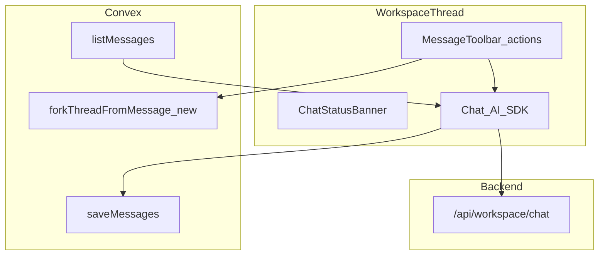

# Workspace chat UX — implementation plan

This plan implements [Workspace chat UX PRD](./workspace-chat-ux-prd.md). Resolve the **Open product confirmations** in that doc before locking UI copy and edge-case behavior.

## Goals

- Per-message **copy**, **retry** (truncate tail + regen), **fork** (prefix → new thread, project inheritance).
- Unified **empty / loading / stream error / persist error** surfaces in the workspace thread.

## Architecture sketch

## Phase 1 — Clipboard and message chrome

- Wire **`MessageActions` / `MessageToolbar`** (or equivalent) around each rendered message in [`src/lib/components/workspaces/WorkspaceThread.svelte`](../../src/lib/components/workspaces/WorkspaceThread.svelte).
- Add small helpers to build **copy strings** from `UIMessage` / assistant segments (reuse logic from [`buildAssistantSegments`](../../src/lib/idea-chat-assistant-parts.ts) for assistant text).
- **Copy** button: `navigator.clipboard.writeText` with **toast or inline “Copied”** feedback; handle permission errors gracefully.
- **Accessibility:** `aria-label` on icon buttons; ensure focus order is sane.

**Exit criteria:** User and assistant messages each have a working copy action; no retry/fork yet.

## Phase 2 — Chat status surfaces

- Introduce a thin **status model** (derived in `WorkspaceThread` or extracted module) combining: `chat.status`, `chatError`, `saveError`, `threadMessages` query status, and “messages empty.”
- Render a **single banner region** (or inline blocks) for: empty thread, stream failure, persist failure—align copy with PRD; keep existing **Retry sync** behavior but unify layout with stream retry.
- Define behavior for **“only user message, assistant pending/error”** once open decision #4 is closed.

**Exit criteria:** Users can always tell **what failed** and see **one primary action** per failure class.

## Phase 3 — Retry (truncate + regenerate)

- Pure function **`truncateMessagesAfterUserMessage(messages, userMessageId)`** → truncated `UIMessage[]`; unit tests for edge cases (not found, last message, consecutive assistants impossible).
- On **Retry** from message index `i`: set `Chat` messages to truncated array, then call the appropriate **regenerate** / **send** API per `@ai-sdk/svelte` `Chat` (verify current SDK pattern for “resend last user” vs `reload` / `regenerate`).
- Ensure **`onFinish` → persistMessages** still runs with the truncated list so Convex rows for removed tail are **updated or deleted**—today `saveMessages` only upserts the array passed; **confirm** whether orphaned rows after the new length need a **`deleteMessagesAfterSequence`** mutation or full replace strategy. **Do not** leave stale messages in `chatMessages`.

**Exit criteria:** After retry, DB transcript matches UI; no ghost messages after refresh.

## Phase 4 — Fork thread

- Convex **`forkThreadFromMessage`** mutation: args `threadId`, `messageId` (or sequence). Verify thread ownership; read source thread for **`projectId` / `scopeType`**; insert new `chatThreads`; bulk-insert `chatMessages` for prefix with **new stable message IDs** or a defined ID remapping strategy compatible with AI SDK (document choice—**new IDs** per message may be simplest for a new `Chat` instance).
- Client: call mutation, then **`goto`** workspace URL with new `thread` query param (preserve `project` when relevant—mirror existing navigation patterns in workspace layout).
- Fork action visibility: e.g. on **user** messages after assistant reply, or on **every** message boundary—product call; default to **per user message** + optional assistant row “fork from here” if needed.

**Exit criteria:** Fork from project thread opens new thread under same project; general stays general; message count matches prefix.

## Phase 5 — Hardening and manual QA

- Run the **manual QA matrix** in the PRD (Testing Decisions); confirm **no orphaned `chatMessages`** after retry/truncate (refresh + optional Convex dashboard check).
- **Automated tests** (unit / Convex) are **optional** for this iteration—add only if low-cost while implementing.

## Risk register

| Risk | Mitigation |
|------|------------|
| `saveMessages` leaves orphaned rows after truncate | Add mutation to delete rows with `sequence > N` or replace-all strategy |
| Regenerate API mismatch with Svelte `Chat` version | Spike in a branch; read AI SDK + `@ai-sdk/svelte` docs |
| Fork + message IDs confuse `Chat` client | New thread gets fresh `Chat` id; load from Convex only |

## File touch list (expected)

- [`src/lib/components/workspaces/WorkspaceThread.svelte`](../../src/lib/components/workspaces/WorkspaceThread.svelte)
- [`src/convex/chat.ts`](../../src/convex/chat.ts) (fork mutation; possible delete-tail helper)
- [`src/lib/chat.ts`](../../src/lib/chat.ts) (Convex client exports if needed)
- New: `src/lib/workspace-chat-message-actions.ts` or similar (truncate + copy helpers)
- Optional: new test files under `src/` if you add automated coverage later

## Dependencies

- None external; relies on existing Convex auth and workspace routing.
